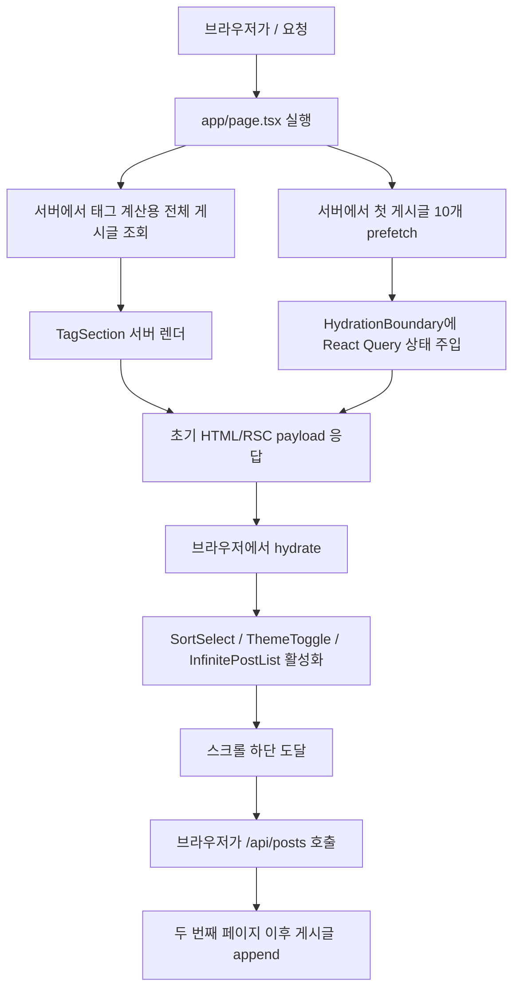
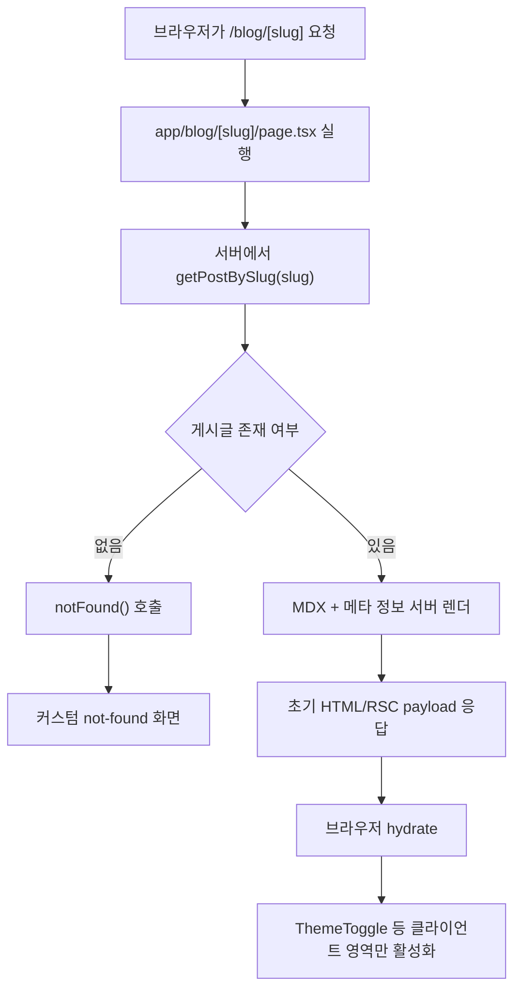

# 원동휘의 개인 아카이브

Next.js App Router와 Notion API를 이용해 만든 개인 아카이브 프로젝트입니다.

## 기술 스택

- Next.js 15 (App Router)
- React 19
- Tailwind CSS v4 + shadcn/ui
- Notion API + notion-to-md
- Vitest + Testing Library + MSW

## 프로젝트 구조

```text
notion-blog-nextjs/
├── app/                  # 라우트 및 페이지
│   ├── _components/      # 앱 전용 컴포넌트
│   └── blog/[slug]/      # 블로그 상세 페이지
├── components/           # 공통 UI/레이아웃/기능 컴포넌트
├── lib/                  # Notion API, 유틸리티
├── tests/                # Vitest 통합 테스트
└── types/                # 공통 타입
```

## 렌더링 구조

이 프로젝트는 `Next.js App Router` 기반이라 페이지를 단순히 `SSR` 또는 `CSR` 둘 중 하나로만 보기는 어렵습니다.
현재 홈과 상세 페이지는 `RSC(Server Components) + 초기 서버 렌더 + 선택적인 Client Component hydration` 구조로 동작합니다.

### 용어 정리

| 용어           | 이 프로젝트에서의 의미                                                                                                                        |
| -------------- | --------------------------------------------------------------------------------------------------------------------------------------------- |
| RSC            | 서버에서 실행되는 React Server Component. 데이터 조회와 마크업 생성은 서버에서 처리되고 브라우저에서 hydrate되지 않습니다.                    |
| 초기 서버 렌더 | 첫 요청 시 서버가 만든 HTML/RSC payload를 브라우저가 받는 단계입니다. DevTools `Network > Doc > Preview`에서 보이는 응답이 여기에 가깝습니다. |
| Hydration      | 브라우저에서 Client Component가 살아나는 단계입니다. 이벤트 핸들러와 상태 관리가 여기서 붙습니다.                                             |
| CSR fetch      | 첫 HTML 이후 브라우저가 추가 데이터를 직접 가져오는 단계입니다. 이 프로젝트에서는 무한 스크롤 다음 페이지 조회가 여기에 해당합니다.           |

### 홈 페이지 (`/`) 구조

| 영역                           | 파일                                                                                              | 초기 렌더                                                                       | 이후 동작                                                                                    |
| ------------------------------ | ------------------------------------------------------------------------------------------------- | ------------------------------------------------------------------------------- | -------------------------------------------------------------------------------------------- |
| 페이지 셸, 레이아웃, 헤더/푸터 | `app/layout.tsx`, `app/page.tsx`                                                                  | 서버에서 렌더                                                                   | 헤더 안의 `ThemeToggle`만 클라이언트에서 hydrate                                             |
| 태그 목록                      | `app/_components/TagSection.tsx`                                                                  | 서버에서 태그 데이터를 계산 후 렌더                                             | 태그 클릭은 `Link`로 URL을 바꾸고, 새 요청에서 서버가 다시 필터링된 화면을 렌더              |
| 정렬 셀렉트                    | `app/_components/SortSelect.client.tsx`                                                           | 초기 마크업은 서버 응답에 포함                                                  | hydrate 후 `router.push()`로 쿼리스트링을 바꾸고, 새 요청에서 서버가 다시 정렬된 화면을 렌더 |
| 게시글 첫 페이지(첫 10개)      | `app/page.tsx`, `lib/queries/posts.server.ts`, `lib/notion.ts`                                    | 서버에서 `prefetchInfiniteQuery()`로 먼저 가져와서 `HydrationBoundary`로 내려줌 | 브라우저는 서버가 준비한 React Query 캐시를 hydrate해서 바로 사용                            |
| 게시글 두 번째 페이지 이후     | `components/features/blog/InfinitePostList.tsx`, `lib/queries/posts.ts`, `app/api/posts/route.ts` | 해당 없음                                                                       | 스크롤 감지 후 브라우저가 `/api/posts`를 호출하는 CSR fetch                                  |
| 프로필 / 문의 카드             | `app/_components/ProfileSection.tsx`, `app/_components/ContactSection.tsx`                        | 서버에서 렌더                                                                   | 별도 클라이언트 fetch 없음                                                                   |
| 에러 바운더리                  | `components/common/QueryErrorBoundary.tsx`                                                        | 클라이언트 컴포넌트로 hydrate                                                   | 무한 스크롤 쿼리 에러를 클라이언트에서 처리                                                  |

### 홈 페이지 요청 흐름



### 상세 페이지 (`/blog/[slug]`) 구조

| 영역                         | 파일                                        | 초기 렌더                                  | 이후 동작                                                         |
| ---------------------------- | ------------------------------------------- | ------------------------------------------ | ----------------------------------------------------------------- |
| 상세 페이지 데이터 조회      | `app/blog/[slug]/page.tsx`, `lib/notion.ts` | 서버에서 `getPostBySlug(slug)` 실행        | 별도 클라이언트 fetch 없음                                        |
| 404 처리                     | `app/blog/[slug]/page.tsx`, `app/not-found.tsx` | 서버에서 게시글이 없으면 `notFound()` 호출 | 커스텀 404 화면으로 전환 |
| 게시글 헤더 / 메타 / 배지    | `app/blog/[slug]/page.tsx`                  | 서버에서 렌더                              | 별도 hydrate 없음                                                 |
| 본문 MDX                     | `app/blog/[slug]/page.tsx`의 `MDXRemote`    | 서버에서 MDX를 렌더                        | 현재 본문 자체를 위한 CSR fetch 없음                              |
| 공통 헤더의 테마 토글        | `components/theme/ThemeToggle.tsx`          | 초기 HTML 포함                             | hydrate 후 테마 전환 가능                                         |

### 상세 페이지 요청 흐름



### 현재 코드 기준 요약

- 홈의 태그 목록과 프로필/문의 카드, 첫 게시글 10개는 서버가 준비합니다.
- 홈의 게시글 목록은 "첫 페이지는 서버 prefetch + hydration", "두 번째 페이지부터는 CSR fetch" 구조입니다.
- 정렬 변경과 태그 변경은 로컬 배열 필터링이 아니라 URL을 바꾸고, 서버가 새 결과를 다시 렌더합니다.
- 상세 페이지는 본문까지 대부분 서버 렌더입니다.
- 현재 상세 페이지에는 댓글, 좋아요, 추천 글 같은 추가 CSR 데이터 패널은 없습니다.

## 개발 환경

- Node.js 24.x
- pnpm >= 10.14.0

## 설치 및 실행

```bash
git clone https://github.com/wondonghwi/notion-blog-nextjs.git
cd notion-blog-nextjs
nvm use
pnpm install
cp .env.example .env.local
pnpm dev
```

## 환경 변수

`.env.local` 파일에 아래 값을 설정하세요.

```bash
NOTION_TOKEN=your_notion_token
NOTION_DATABASE_ID=your_notion_database_id
```

## 주요 명령어

```bash
pnpm dev            # 개발 서버
pnpm build          # 프로덕션 빌드
pnpm start          # 프로덕션 실행
pnpm lint           # 린트
pnpm test           # Vitest
pnpm test --run     # 단발 실행(CI 용)
pnpm test:watch     # watch + verbose
```

## CI

GitHub Actions(`.github/workflows/ci.yml`)에서 아래를 자동 실행합니다.

1. `pnpm lint`
2. `pnpm test --run`
3. `pnpm build`
